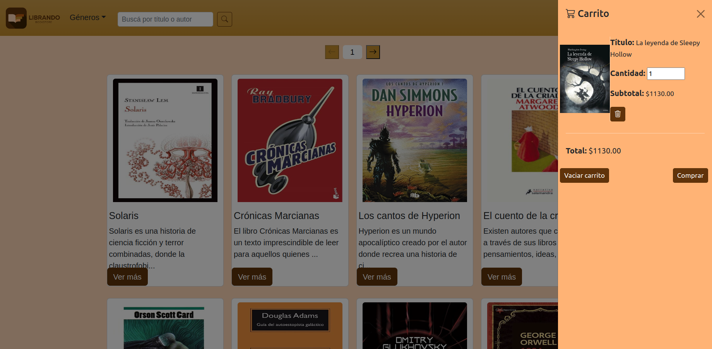

<a name="readme-top"></a>
[![Contributors][contributors-shield]][contributors-url]
[![Issues][issues-shield]][issues-url]

<!-- PROJECT LOGO -->
<br />
<div align="center">
  <a href="https://github.com/Merssith/Librando-FRONT">
    
  </a>

<h3 align="center">FRONTEND ECOMMERCE LIBRANDO BOOKSTORE</h3>

  <p align="center">
    Proyecto de ecommerce para bootcamp Plataforma 5
    <br />
    <a href="https://github.com/Merssith/Librando-FRONT"><strong>Explora nuestro proyecto »</strong></a>
    <br />
    <br />
    <a href="https://github.com/Merssith/Librando-FRONT/issues">Reportar un bug</a>
    ·
    <a href="https://github.com/Merssith/Librando-FRONT/issues">Solicitar una feature</a>
  </p>
</div>

<!-- TABLE OF CONTENTS -->
<details>
  <summary>Contenido</summary>
  <ol>
    <li>
      <a href="#sobre-el-proyecto">Sobre el proyecto</a>
      <ul>
        <li><a href="#stack-de-tecnologías">Stack de tecnologías</a></li>
      </ul>
    </li>
    <li>
      <a href="#empezando">Empezando</a>
      <ul>
        <li><a href="#pre-requisitos">Pre-requisitos</a></li>
        <li><a href="#instalación">Instalación</a></li>
      </ul>
    </li>
    <li><a href="#roadmap">Roadmap</a></li>
    <li><a href="#contribuye">Contribuye</a></li>
    <li><a href="#contacto">Contacto</a></li>
    <li><a href="#agradecimientos">Agradecimientos</a></li>
  </ol>
</details>

<!-- ABOUT THE PROJECT -->

## Sobre el proyecto



“Librando” es un proyecto de e-commerce de venta de novelas.
Los usuarios podrán registrarse y navegar a través de las categorías de géneros de novelas, realizar búsquedas y comprar sus novelas favoritas fácilmente.
También contará con un módulo administrador que permitira gestionar toda la base de datos del sitio.

<p align="right">(<a href="#readme-top">volver a arriba</a>)</p>

### Stack de tecnologías

- Axios
- React
- Redux
- React Bootstrap y CSS


<p align="right">(<a href="#readme-top">volver a arriba</a>)</p>

<!-- GETTING STARTED -->

## Empezando

Este FrontEnd esta conectado a un Backend que es necesario para poder operar

### Pre-requisitos

Deberas complir los siguientes pre-requisitos para poder utilizar este proyecto.

Levanta el [Backend](https://github.com/Merssith/Librando-BACK)

### Instalación

1. Clona el repositorio en tu local
   ```sh
   git clone https://github.com/Merssith/Librando-FRONT.git
   ```
2. Instala las dependencias NPM
   ```sh
   npm install
   ```
3. Levanta la app
   ```sh
   npm start
   ```

<p align="right">(<a href="#readme-top">volver a arriba</a>)</p>

<!-- API  -->

## Roadmap

- [x] Modulo de usuario
  - [x] Registrarse
  - [x] Login/Logout
  - [x] Persistencia de carrito y de usuario
  - [x] Buscar libros por autor y nombre del libro
  - [x] Navegar por las categorias
  - [x] Ver los detalles del libro
  - [x] Dejar una review de un libro comprado
  - [x] Recibir correos de confirmación
  - [x] Cerrar una compra
  - [x] Ver datos de usuario
  - [x] Ver compras anteriores
- [x] Modulo de administrador
  - [x] Ver todos los usuarios
  - [x] Promover usuarios a admin
  - [x] Eliminar usuarios
  - [x] Ver todas las ordenes
  - [x] Modificar una orden
  - [x] Agregar, editar y eliminar libros del catalogo
  - [x] Agregar, editar y eliminar generos del catalogo (categorias)
- [ ] Otros
  - [ ] OAuth2

<p align="right">(<a href="#readme-top">volver a arriba</a>)</p>

<!-- CONTRIBUTING -->

## Contribuye

<p>Las contribuciones de la comunidad Dev nos ayudan a aprender, inspirarnos y crear cosas nuevas! Todas las contrinuciones seran muy bienvenidas!</p>
<p>Si tienes algunas sugerencia para mejorar nuestro proyecto, por favor forkea el repositorio y crea un pull request.</p>
<p>Muchas gracias!</p>

1. Forkea el repositorio
2. Crea tu branch (`git checkout -b feature/MiFeature`)
3. Comitea tus cambios (`git commit -m 'Agrego MiFeature'`)
4. Pushea a la branch (`git push origin feature/MiFeature`)
5. Abri un pull request

<p align="right">(<a href="#readme-top">volver a arriba</a>)</p>

<!-- CONTACT -->

## Contacto

- Mercedes Salcedo - mercedes.salcedo1989@gmail.com
- Franco Livelli - franco.livelli@gmail.com
- Mikelzon Sarabia - Mikelzonsarabia@gmail.com
- Alberto Carrillo de Comas - albertokarri@gmail.com
- Diego Siboldi - die.siboldi@gmail.com
- Julian Pacheco - jpjulianpacheco@gmail.com

Link del proyecto: [https://github.com/Merssith/Librando-FRONT](https://github.com/Merssith/Librando-FRONT)

<p align="right">(<a href="#readme-top">volver a arriba</a>)</p>

<!-- ACKNOWLEDGMENTS -->

## Agradecimientos

- A Pablo Burgos
- A todo el staff de Plataforma 5
- A los jurados
- A nuestros compañeros de bootcamp

<p align="right">(<a href="#readme-top">volver a arriba</a>)</p>

<!-- MARKDOWN LINKS & IMAGES -->
<!-- https://www.markdownguide.org/basic-syntax/#reference-style-links -->

[contributors-shield]: https://img.shields.io/github/contributors/Merssith/Librando-FRONT.svg?style=for-the-badge
[contributors-url]: https://github.com/Merssith/Librando-FRONT/graphs/contributors
[issues-shield]: https://img.shields.io/github/issues/Merssith/Librando-FRONT.svg?style=for-the-badge
[issues-url]: https://github.com/Merssith/Librando-FRONT/issues
